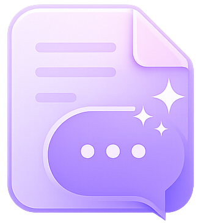

<div align="center">
<h1> ChatDocs</h1>

It is an AI-powered web application that lets users upload PDF documents and have intelligent conversations with them. 
Ask questions in plain English, get instant accurate answers with exact page references.

---
</div>

##  The Problem: 
- Humans waste millions of hours every day searching through documents for information that takes seconds to find the text.
- Finding specific information inside large documents is slow, painful, and extremely inefficient.


We all deal with large documents every day.
- Student | 500 page textbook | Exam tomorrow. Cannot find specific topic. Reads for hours. 
- Employee | 800 page company handbook | Simple policy question. HR is busy. Waits 2 days for reply. 
- Researcher | 50 research papers | Needs specific methodology. Reads every paper manually. Takes weeks. 
- Lawyer | 2000 page legal contract | Client needs specific clause urgently. CTRL+F misses context. 
- Doctor | Medical literature | Needs specific drug interaction info. Cannot search by meaning.

---

## The Solution: 
- Upload any PDF document.
- Ask any questions.
- Get the exact answer in seconds.
- With the exact page number it came from.

---

## Screenshots
- **Login Page**

- **Sidebar Page**

- **Chat Page**

- **History Page**


---

## Tech Stack

### Frontend
| Technology | Purpose |
|------------|---------|
| React.js | User interface |
| Tailwind CSS | Styling |
| Axios | API calls |
| React Router | Navigation |

### Backend
| Technology | Purpose |
|------------|---------|
| Node.js | Runtime environment |
| Express.js | Web framework |
| MongoDB | Main database |
| Mongoose | MongoDB  |
| Passport.js | Google OAuth |
| JWT | Authentication tokens |
| Multer | File upload handling |
| pdf-parse | PDF text extraction |

### AI & Search
| Technology | Purpose |
|------------|---------|
| Google Gemini API | Text embeddings (gemini-embedding-001) |
| Groq API | LLM answer generation (llama-3.3-70b-versatile) |
| Pinecone | Vector database (semantic search) |

### DevOps
| Technology | Purpose |
|------------|---------|
| Git + GitHub | Version control |
| Vercel | Frontend deployment |
| Render | Backend deployment |
| MongoDB Atlas | Cloud database |

---

## Features

### Currently Built ✅
- [x] Google OAuth Authentication (Sign in with Google)
- [x] PDF Document Upload (up to 10MB)
- [x] PDF Text Extraction
- [x] RAG Pipeline (Retrieval Augmented Generation)
- [x] Google Gemini Embeddings (gemini-embedding-001)
- [x] Pinecone Vector Database (semantic search)
- [x] Groq AI Answer Generation (llama-3.3-70b-versatile)
- [x] Top-K Retrieval (K=4 most relevant chunks)
- [x] Query Cleaning and Validation
- [x] Context Window Management
- [x] Real-time Streaming Responses (word by word)
- [x] Page References (every answer cites exact page)
- [x] Chat History (persists after logout)
- [x] Multiple Document Management
- [x] Duplicate Document Prevention
- [x] Conversation Delete
- [x] Document Delete (clears vectors too)
- [x] Toast Notifications
- [x] Chat History Awareness (last 6 messages)
- [x] Error Handling (empty PDF, no chunks, irrelevant questions)

---

##  Architecture: 

### RAG Pipeline
UPLOAD PHASE (once per document):
PDF Upload
→ Extract Text (pdf-parse)
→ Split into Chunks (1000 chars, 200 overlap)
→ Generate Embeddings (Google Gemini)
→ Store in Pinecone with metadata (page numbers)

## QUESTION PHASE (every question):
User Question
→ Clean Query
→ Generate Question Embedding (Gemini)
→ Search Pinecone → Top 4 Similar Chunks
→ Format Context with Page Numbers
→ Add Chat History
→ Stream to Groq AI (llama-3.3-70b-versatile)
→ Stream Response to Frontend (SSE)
→ Save to MongoDB
---

### Prerequisites
```
Node.js v22+
MongoDB Atlas account
Google Cloud Console account
Groq API account (free)
Google AI Studio account (free, for Gemini)
Pinecone account (free)
```

### Environment Variables
```
PORT=5000
MONGODB_URI=your_mongodb_connection_string
JWT_SECRET=your_super_secret_jwt_key
GOOGLE_CLIENT_ID=your_google_client_id
GOOGLE_CLIENT_SECRET=your_google_client_secret
GOOGLE_CALLBACK_URL=http://localhost:5000/api/auth/google/callback
CLIENT_URL=http://localhost:5173
GROQ_API_KEY=your_groq_api_key
GEMINI_API_KEY=your_gemini_api_key
PINECONE_API_KEY=your_pinecone_api_key
PINECONE_INDEX_NAME=your_pinecone_index_name
```

### Getting Started
```bash
# Clone the repository
git clone https://github.com/kaushiki-tripathi/ChatDocs.git

# Go to backend folder
cd ChatDocs/backend

# Install dependencies
npm install

# Create .env file and add your credentials

# Start development server
npm run dev

# Go to frontend folder (in a new terminal)
cd ../frontend

# Install dependencies
npm install

# Start frontend
npm run dev
```

## Author
- Kaushiki Tripathi
- LinkedIn: https://www.linkedin.com/in/kaushikitripathi2005/
